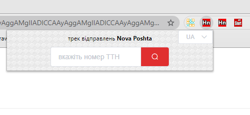
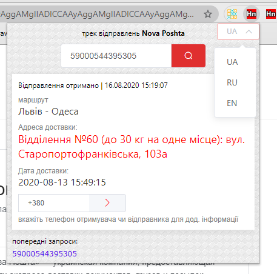
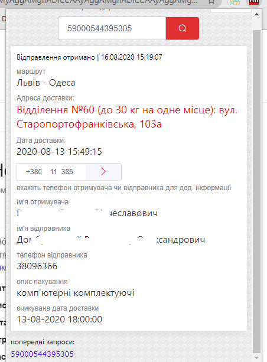

Firefox browser extension that allows to track your NovaPoshta packages.
#####  links:
https://addons.mozilla.org/en-US/firefox/addon/novaposhta-track/  
https://chrome.google.com/webstore/detail/novaposhta-track/dlkjflpmejaehpobbokpgofkbfkojpea?hl=ru&authuser=0
##### main view

#####todo:
- [x] - добавить фетч детальной инфы по номеру телефона  (02.10.2020) :white_check_mark:
- [x] - сделать локализации интерфейса (02.10.2020) :white_check_mark:
- [ ] - сделать страницу истории через табсы, роутер или v-show; туда автоматически добавлять информацию по
каждой найденной посылке(маршрут, адрес доставки и т.д)